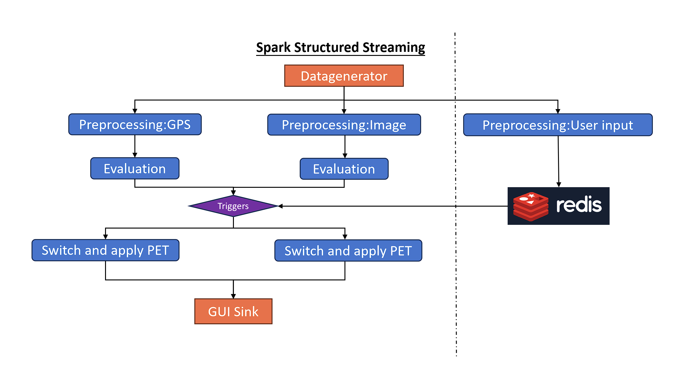
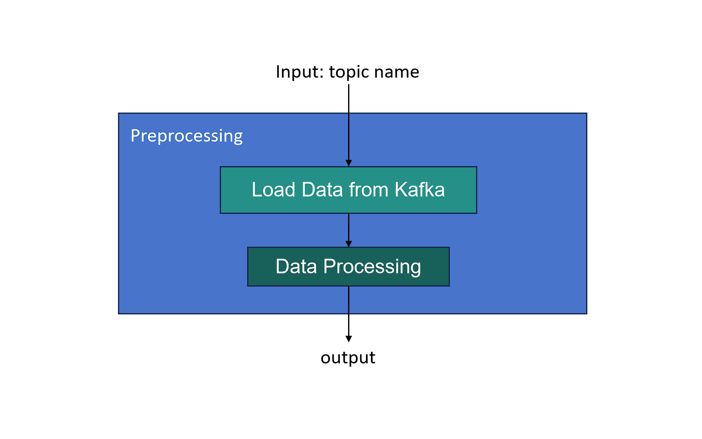
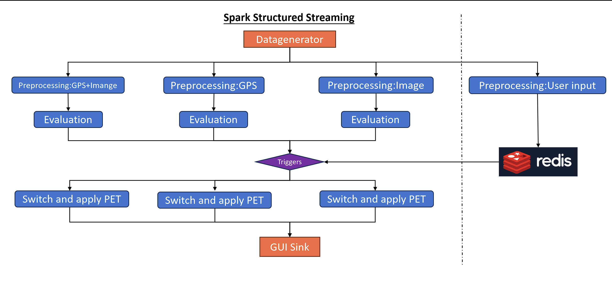
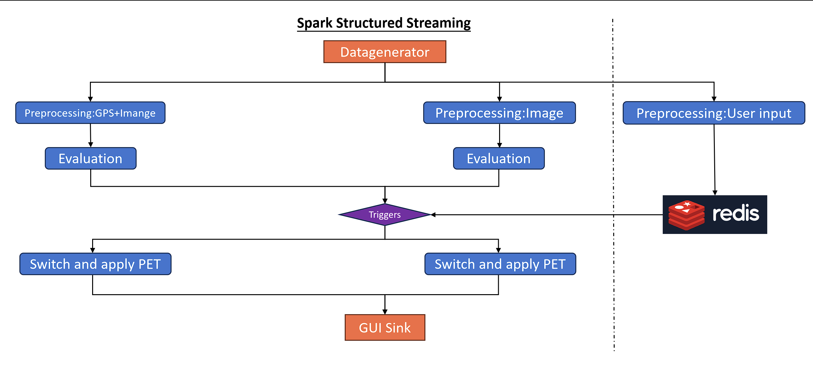

# PIS_Group2
## Project Introduction
We aim to evaluate different types of latency under the same scenario with varying frame rates — such as flow latency, redeployment latency, and others.
Our work focuses on Spark Structured Streaming. Kafka is used as a message broker to simulate continuous data input. The incoming data is encapsulated into a class, processed through the application logic, and finally written to a sink for analysis.

## Install
This project need [Spark](https://spark.apache.org/downloads.html),
[Kafka](https://kafka.apache.org/downloads),
[Redis](https://redis.io/download/),
[Scala](https://www.scala-lang.org/download/). If u don't have them, need to download it.
After install them, need to connect to kafka and redis.

Connect to kafka: should in folder kafka
```sh
bin/kafka-storage.sh random-uuid
bin/kafka-storage.sh format -t <uuid> -c ./config/kraft/server.properties  
sudo bin/kafka-server-start.sh ./config/kraft/server.properties
```
Connect to redis;
```sh
sudo service redis-server start
```
Besides the dependencies in [Maven](./pom.xml) also is required.
## Implement

First of all: show the structure of the pipeline.

As you can see from this diagram, 
this structural picture of stream processing is made up of many components,
each of which will be explained next.
### Data-generator:Simulated data written in kafka
The function of this component is to send data to Kafka. Now we assume
only have three types of data. For instance GPS ,IMAGE and User-Input.
We assumed simpler scenarios for this project compared to the reality. 

### Preprocessing

The input of Preprocessing is the name of the topic.
After that it goes to consume the data from Kafka,
the most important information is extracted, packaged into a class,
and then uses an instance of that class as output.
### Evaluation and Triggers
Actually, Triggers belongs to the component Evaluation.
It is taken out here to show the external signal input
(User Input) more clearly. 
Here this external signal represents an artificial way to tell the program to switch the PET, 
and in the Evaluation section, 
the main purpose is to automatically determine
whether the PET (policy enhancement technique) needs to be switched or not.
#### Dynamically change the stream
If there exists a situation where data in another stream is needed while one stream is being processed. 
In this situation we need to dynamically add a new stream, and delete the original stream.

First of all:add a stream

As you can see from the diagram, 
I'm assuming that not only GPS data but also IMAGE data is needed in the stream GPS.
This stream on the far left is the newly added stream.

Then remove the original stream:

This is the structure of the final stream processing.
### Switch and apply PET
The switching of PET and the application of algorithms is performed in this component. 
The corresponding algorithm is instantiated from the external library and the PET corresponding algorithm is called to process the data.
### Redis
The main purpose of this section is to have the PET's ID 
and PET's activation as a global variable, 
so that real-time updates can be achieved. 
Because in some cases, the change of PET of one stream may cause the change of PET of other streams.
### GUI Sink
This part is all about presenting the results on a graphical interface.
