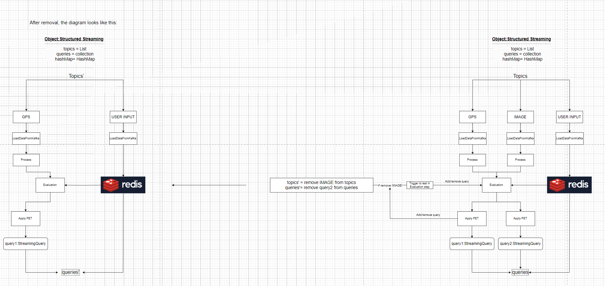
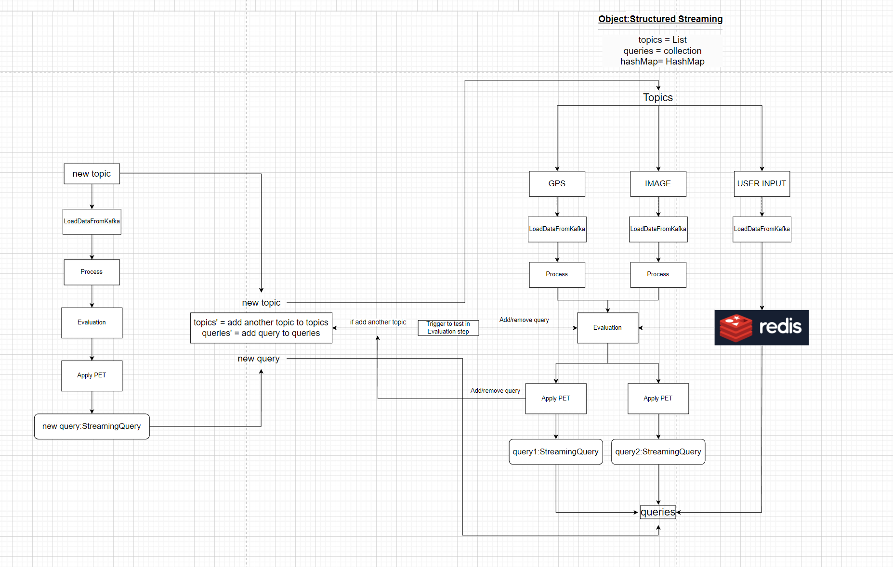
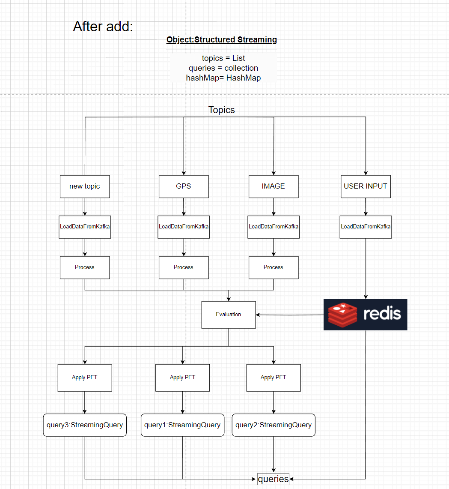

# PIS_Group2
## Project Introduction
We want to evaluate the different type of latency or something else
in the same scenario with different frame. My work is about Spark 
Structured Streaming.
## Install
This project need [Spark](https://spark.apache.org/downloads.html),
[Kafka](https://kafka.apache.org/downloads),
[Redis](https://redis.io/download/),
[Scala](https://www.scala-lang.org/download/). If u don't have them, need to download it.
After install them, need to connect to kafka and redis.
Connect to kafka: should in folder kafka
```sh
bin/kafka-storage.sh random-uuid
bin/kafka-storage.sh format -t <uuid> -c ./config/kraft/server.properties  
sudo bin/kafka-server-start.sh ./config/kraft/server.properties
```
Connect to redis;
```sh
sudo service redis-server start
```
Besides the dependencies in [Maven](./pom.xml) also is required.
## Implement
### Simulated data written in kafka
Try to send data to kafka. And test it success or not. Now we assume
only have three type of data. For instance GPS ,IMAGE and User-Input,
### Stream Process
Remove stream:

Add stream:


#### Load data
Subscribe topic from kafka
#### Process
Because the data may take much redundant Info, so I make a class to select the info,
which is needed.
#### Evaluation
Because it may have some trigger to change the PET, so in this class just measure the
conditions reached or not.
#### ApplyPET
Loaf PET(from external lib) and process data which should be processed.
Or according to the data PEt required to merge stream.
#### StreamingQuery
And then generate a StreamingQuery to monitor and manage the query.